# AAU Typst Template (Naitsa)

AAU report template written in Typst with extensive customizability.

Includes a short IEEE paper template with info page and summary page.

## Quick-start Guide for Online Usage (Single File Template)
> _**This is the recommended option** because of restrictions on the number of files online users can have in a project in the free tier of the Typst Online App._
> 
> **Note:** Uses online fonts. If running in a local project, modify fonts or ensure fonts are available locally.

Copy all the contents of the folder `aau-quick-report/` into your project.

Should look like this:

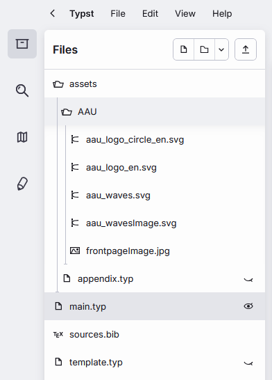

## Full Template (Modularized)

Recommended if you want more flexibility. It is much easier to modify the template, as it is split into multiple modules.
The single file template is a concatenated version of the modularized template.

Simply copy all files from the `aau-report/` folder into your project's main folder (where your main.typ file will be).

## IEEE Paper with AAU Styled Info Section and Summary Page

> **Note:** Uses online fonts. If running in a local project, modify fonts or ensure fonts are available locally.

Uses the IEEE paper template from Typst, and adds the AAU info page and required summary.

To use, copy all files from the `aau-ieee-paper/` folder into your project's main folder (where your main.typ file will be).

Should look like this:

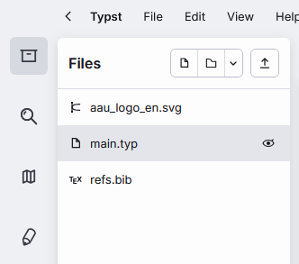


## The Look of it All

### Fonts

In the template, under `configs.typ` (or by searching for "FONT CONFIGURATION"), the fonts can be modified.

There are two fonts: the body font for the main text, and the sans font for headings and similar elements.
```typst
// **** FONT CONFIGURATION ****
#let body-font = "Libertinus Serif"
#let sans-font = "New Computer Modern"
```
By default, the template uses “Libertinus Serif” and “New Computer Modern”, as they are bundled with Typst.
For the demonstration, however, the fonts “Barlow” and “Source Sans Pro” (provided by browsers) are used instead, as they better suit the author’s preferences (Naitsabot).

### Report

#### Front Matter Pages
Cover page:

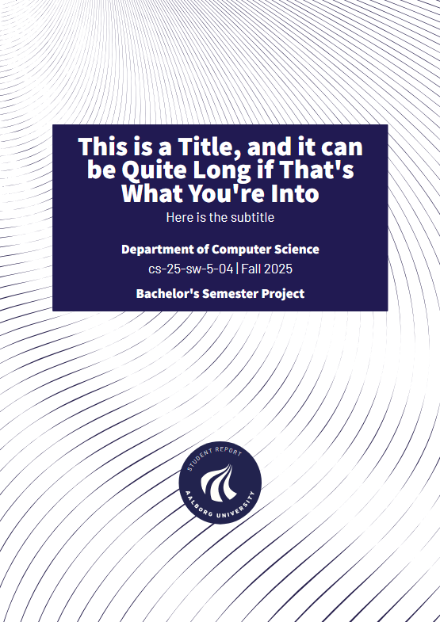

Alternative cover page:

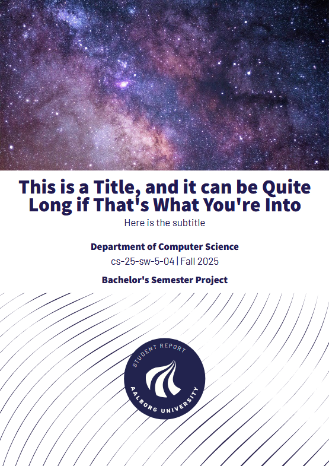

Colophon page:

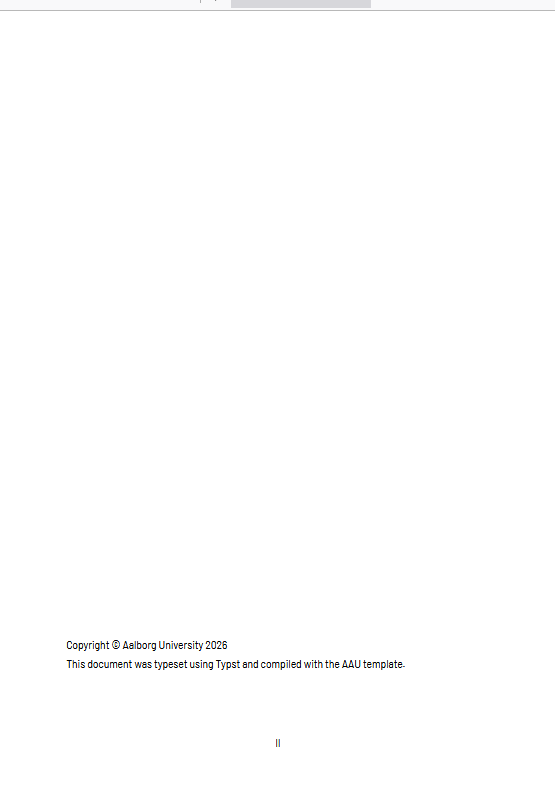

Info and abstract page:

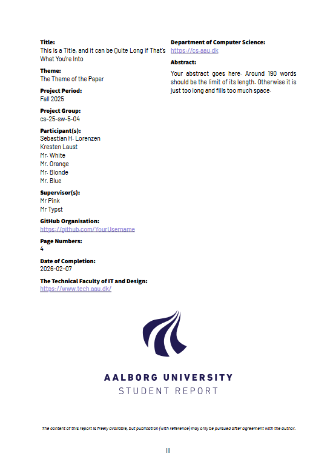

Preface:

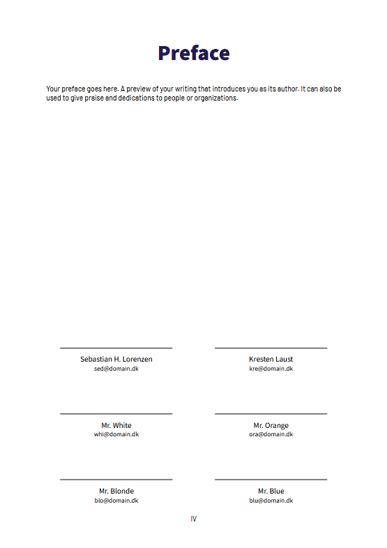

Table of contents:

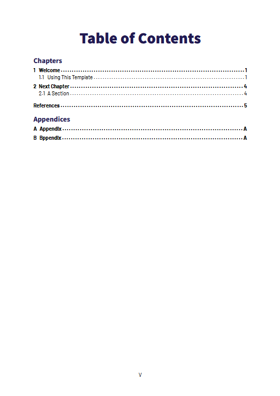

#### Main Content Pages

There is a lot of styling that can be shown, but this is the main gist of it.

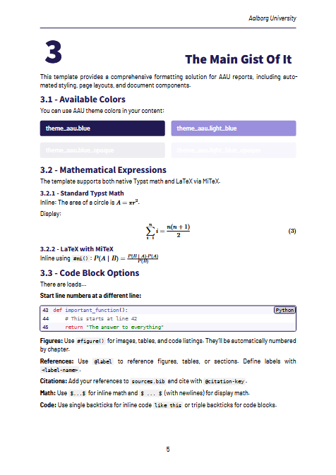

#### Back Matter Pages

Bibliography/References pages (other styles exist):

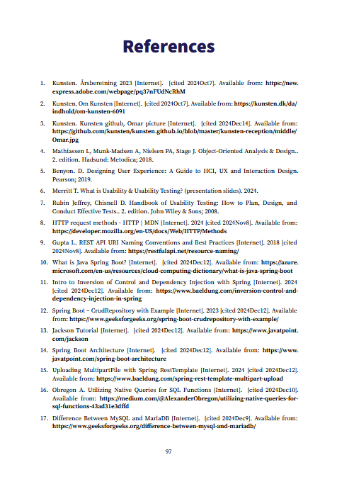

Appendices pages:


### Paper

Info and abstract page:

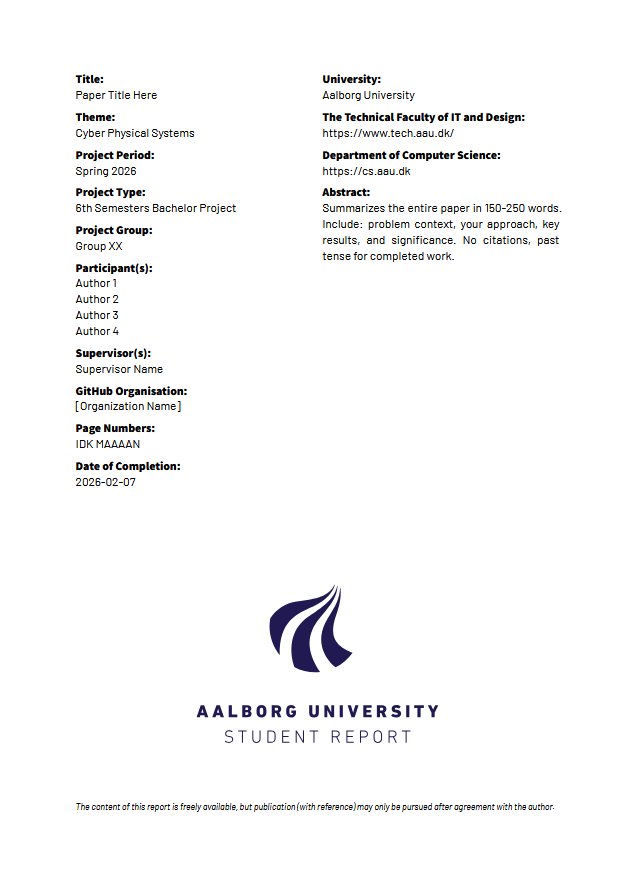

Summary page:

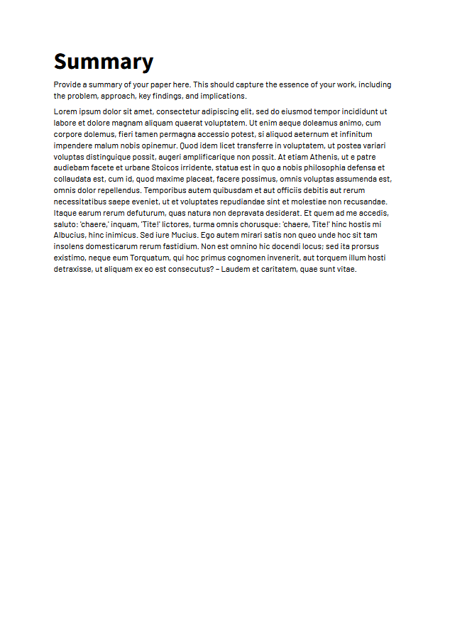

Main content IEEE paper pages:


## Attribution

This project was originally based on [AAU Typst Template](https://github.com/krestenlaust/AAU-Typst-Template) by Kresten Laust, licensed under MIT License. It has since evolved into an independent project with significant modifications and enhanced coding practices.
